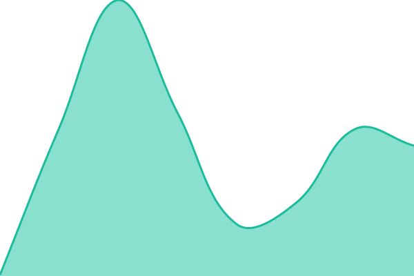
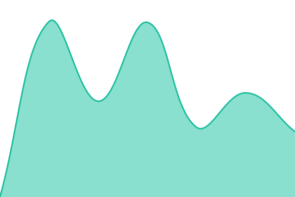

# [📈 Live Status](https://SaschaLucius.github.io/upptime): <!--live status--> **🟩 All systems operational**

This repository contains the open-source uptime monitor and status page for [Sascha Lucius](https://www.linkedin.com/in/sascha-lucius), powered by [Upptime](https://github.com/upptime/upptime).

With [Upptime](https://upptime.js.org), you can get your own unlimited and free uptime monitor and status page, powered entirely by a GitHub repository. We use [Issues](https://github.com/SaschaLucius/upptime/issues) as incident reports, [Actions](https://github.com/SaschaLucius/upptime/actions) as uptime monitors, and [Pages](https://SaschaLucius.github.io/upptime) for the status page.

<!--start: status pages-->
<!-- This summary is generated by Upptime (https://github.com/upptime/upptime) -->
<!-- Do not edit this manually, your changes will be overwritten -->
<!-- prettier-ignore -->
| URL | Status | History | Response Time | Uptime |
| --- | ------ | ------- | ------------- | ------ |
|  [Flow-Timer](https://flow-timer.de/) | 🟩 Up | [flow-timer.yml](https://github.com/SaschaLucius/upptime/commits/HEAD/history/flow-timer.yml) | 

 2066ms
     
 | 

<a href="https://SaschaLucius.github.io/upptime/history/flow-timer">100.00%</a>
    

|  [Svelte Umami](https://saschalucius.github.io/svelte-umami/) | 🟩 Up | [svelte-umami.yml](https://github.com/SaschaLucius/upptime/commits/HEAD/history/svelte-umami.yml) | 

 82ms
     
 | 

<a href="https://SaschaLucius.github.io/upptime/history/svelte-umami">100.00%</a>
    

|  [Constellation Board](https://saschalucius.github.io/constellation-board/) | 🟩 Up | [constellation-board.yml](https://github.com/SaschaLucius/upptime/commits/HEAD/history/constellation-board.yml) | 

 61ms
     
 | 

<a href="https://SaschaLucius.github.io/upptime/history/constellation-board">100.00%</a>
    

|  [HeadBook](https://saschalucius.github.io/headBook/) | 🟩 Up | [head-book.yml](https://github.com/SaschaLucius/upptime/commits/HEAD/history/head-book.yml) | 

 75ms
     
 | 

<a href="https://SaschaLucius.github.io/upptime/history/head-book">100.00%</a>
    

|  [Scrum-GUI](https://scrum-gui.de/) | 🟩 Up | [scrum-gui.yml](https://github.com/SaschaLucius/upptime/commits/HEAD/history/scrum-gui.yml) | 

 1025ms
     
 | 

<a href="https://SaschaLucius.github.io/upptime/history/scrum-gui">100.00%</a>
    

<!--end: status pages-->

[**Visit our status website →**](https://SaschaLucius.github.io/upptime)

## 📄 License

- Powered by: [Upptime](https://github.com/upptime/upptime)
- Code: [MIT](./LICENSE) © [Anand Chowdhary](https://anandchowdhary.com), supported by [Pabio](https://pabio.com)
- Data in the `./history` directory: [Open Database License](https://opendatacommons.org/licenses/odbl/1-0/)
